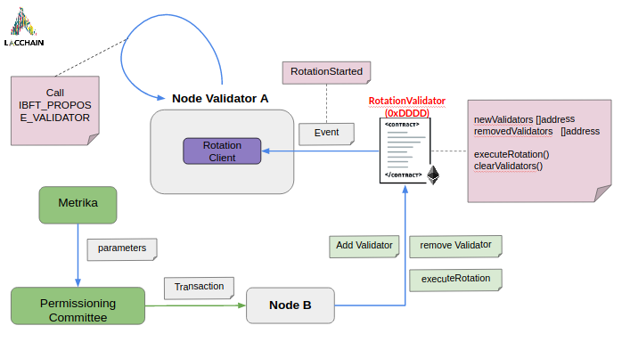
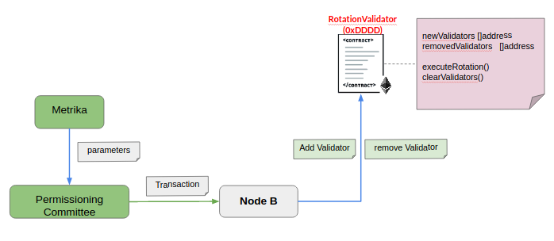
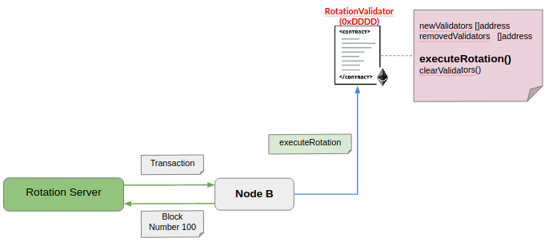

# Solution Architecture

In this section we will review the different components of the architecture, function and relationship with the other components.

This solution serves to rotate validators in each round of block generation. This means that in each generation round, new nodes will be promoted as validators and the nodes that were working as validators but had crashes or failures during the last round, in the new round will not be considered as validators and will be removed from the list of validators of the blockchain.

## Backend Components

### Node
Is a validator node part of the LACChain network. It use Hyperledger Besu with which the p2p connection is maintained, broadcast transactions with the other nodes of the network. This component generate new blocks in the network.

### Rotation Client
Its role is to listen to Rotation smart contract events. Specifically the event that starts validators rotation (event rotationStarted). When this event is emitted, the nodes that are validators first obtain concurrently the list of the new nodes that will be validators and the list of the nodes that will be removed as validators. After obtaining the lists, the node begins to vote to remove and add the new validators.

### Rotation Server
Its role is to receive metrics generated by the validator nodes. With these metrics the server generates a list of the new nodes that will become validators in the next round and a list of the validators that will be removed. Then it sends transactions to the blockchain node to fill the lists mentioned before, which are kept in the Rotation smart contract. Then the server is in charge of verifying which block it is in. When the blockchain reaches the specific block where the validator rotation should take place, the server sends the transaction to the blockchain for the validator rotation to start.

## Smart Contracts

### Rotation
This smart contract is in charge of recording the new nodes that will be validators and the validator nodes that will be removed in the next round, which won't generate blocks. It is also in charge of emiting the event that starts the rotation of validators in the LACChain network.

## Behavior

### Record a node which will/won't be validator

Based on the metrics sent to the server, it is chosen which node will be added and which will not be part of the consensus in the next round of blocks. Validator address is registered in the Rotation smart contract.

### Start Validators Rotation

The server is verifying which is the last block generated in the blockchain. In case the last block is the one indicated to start the rotation, then the server sends a transaction to the blockchain, with which the validator rotation will start.

### Vote for add/remove validator

Validator nodes assisted by the client component are listening for events. When the rotationStarted event is emitted then the client concurrently uses this [ibft-api](https://besu.hyperledger.org/en/stable/Reference/API-Methods/#ibft_proposevalidatorvote) and begins to send the requests to the blockchain node, which will remove and add validators to the next round of block generation.