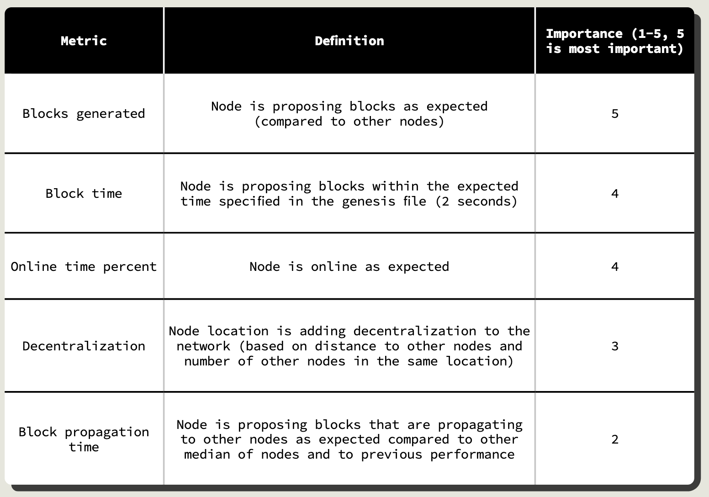
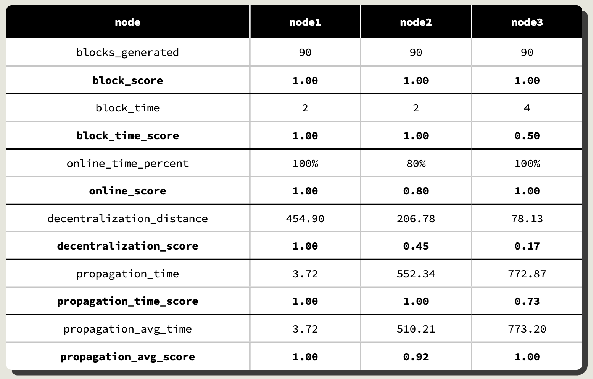
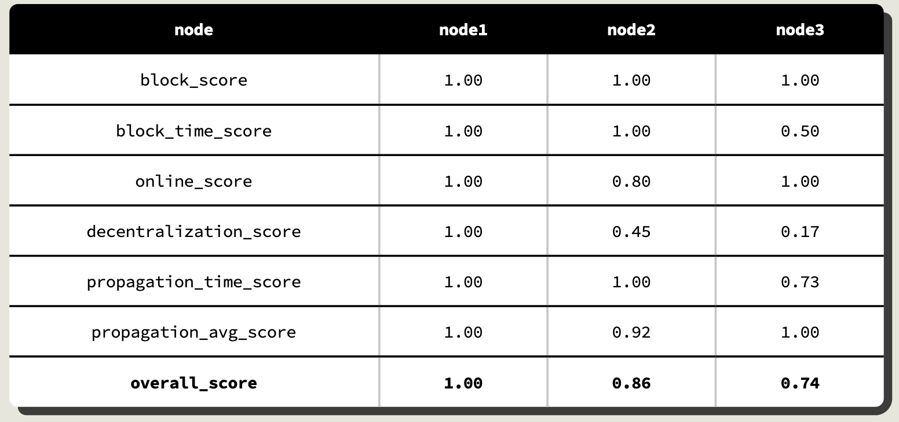

# 1. Context

Block generation is a process executed by validator nodes and consists of proposing and accepting (i.e., voting for) sets of transactions to become new blocks appended to the chain. Every blockchain network has a well-defined mechanism for the nodes to propose and accept blocks, which is known as the consensus protocol. In the most popular permissionless networks, the consensus protocol is generally proof of work, originally proposed and adopted by the Bitcoin network. This consensus protocol introduces a reward for the block producers or validators, which is imperative in stimulating participation in these types of networks. As a trade-off, proof of work leads to the use 8 of amounts of energy equivalent to the energy consumed by medium-size countries [7] and reduces the decentralization of block generation down to only a few people who are in charge of mining pools, which are responsible for deciding which transactions go into the new blocks.

However, in permissioned networks there is no need to stimulate validator nodes by rewarding them with a cryptocurrency. In general, in permissioned networks, validator nodes take turns to generate new blocks, and are operated by known entities that maintain these nodes because of their interest in the existence and well-functioning of the network to allow blockchain-based government and enterprise to scale. 

# 2. LACChain Framework's Proposal

The [LACChain Framework for Permissioned Public Blockchain Networks](https://publications.iadb.org/en/lacchain-framework-permissioned-public-blockchain-networks-blockchain-technology-blockchain) encourages a consensus protocol consisting of a practical byzantine fault-tolerant proof of authority with the following characteristics: 

* Blocks need to be signed by a majority of validator nodes to be valid.
* Finality is instantaneous or semi-instantaneous.
* History cannot be rewritten. 
* Only nodes permissioned as validators can propose and vote new blocks. 
* Validator nodes have a time slot to propose a new block. When time expires, the validator is replaced by another available validator. 
* Validator nodes must accept any valid transaction and report any invalid transaction. 
* Validator nodes must be resilient. 

Validators do not compete to produce blocks, but rather take turns. As such, finality is instantaneous and new blocks are always appended at the end, never rewriting the history. If there were an attack by a majority of validator nodes trying to rewrite the history, any honest node in the network (including validators and not validators) could simply refuse to accept it as soon as the honest node finds that the hash of the block previous to the last proposed block does not match with the hash in the latest version of the chain the honest nodes have. 

# 3. LACChain's Scheme for Validator Rotation

Additionally, the LACChain Framework has developed and encourages the implementation of the following Scheme for Validator Rotation, a set of rules to score and rotate nodes that maximize decentralization and reliability. The scheme is based on the following principles: 

     I. Validator nodes are divided into active and inactive. 

     II. The number of active validator nodes is fixed to 11, because 11 is the smallest number of nodes to allow for 4 validators down in a BFT/PoA scheme. 

     III. Any entity that complies with the network requirements to run a validator must be allowed to do it. These requirements must only have the goal of ensuring that an entity is capable of maintaining a reliable validator node. 

     IV. Validator nodes are graded according to the Node Health Score, which is based on five metrics: blocks generated, block time, online time percent, decentralization, and block propagation time. 

     V. After  well-defined  optimal  amounts  of  time,  active  and  passive  nodes  rotate.  Rotation probabilities are calculated according to health scores (i.e., a node with a higher score has lower probability of being rotated out). 

     VI. The Permissioning Committee supervises the process. 

Active validators must enable the rotation with their votes (to add and remove the proposed validators). 

## 3.1. Scoring of Validator Nodes

In order to rotate nodes in a way that maximizes the performance and decentralization of the network, it is necessary to first understand the health and contribution of active validator nodes. This framework proposes doing this by calculating a Node Health Score, based in the following 5 metrics: 

Table 1. KPIs evaluated in validator nodes.

 

The Node Health Score algorithm is as follows: 

* blocks_score: blocks_generated / max of blocks_generated across all nodes. 
* block_time_score: 1 / (block_time / 2). 
* decentralization_distance: avg distance to every other node / number of nodes in same location. 
* decentralization_score: decentralization_distance / max of decentralization_ distance across all nodes. 
* online_score: online_time_percent / 100. • propagation_avg_score: propagation_avg_time / propagation_time. if the result is greater than 1, score is 1. 
* propagation_time_score: propagation_time / median of propagation_time across all nodes. if the result is greater than 1, score is 1 

Table 2 shows an example of 3 nodes being scored according to the Node Health Score algorithm. Table 3 shows the overall score for the same set of nodes and performances. 

 

Table 2. Example of scoring for three nodes. 

  

Table 3. Example of overall score. 

 

## 3.2. Rotation of Validator Nodes

The validator node health scores are useful to monitor the health of the network, and they are used as inputs to determine the rotation of active and inactive validator nodes. Active validator nodes can be rotated out under two circumstances: 

* Health check round 

* General rotation round 

### 3.2.1. Health Check Rounds

The health check rounds are periodical checks on the validators’ performance. They are intended to identify validator nodes that are underperforming and rotate them before they lead to a malfunction of the network (e.g., delaying or interrupting block generation). The rules applied are the following: 

* Every 30 minutes, the scoring methodology will run to 1) calculate an overall health score for each active node and 2) identify any nodes that are performing below thresholds. Thresholds are presented in Table 4. 

* If a node is performing below threshold in the 30 minutes check, a report and an alert are sent to the Permissioning Committee which will decide if the node should be immediately rotated out.

* If the node continues to perform below thresholds for 24 hours, the node will be flagged for rotation out and rotation will be triggered automatically. 

In the example scores presented in Tables 2 and 3, node #2 would be identified as not hitting the online time percent threshold and node #3 would be identified as not hitting the block time threshold.

Table 4. Thresholds of minimum performance accepted.

 

### 3.2.2. General Rotation Round

The general rotation round is the process established to organically rotate out active and rotate in inactive validator nodes. The purpose of this rotation is to allow any entity capable of maintaining a reliable validator node to participate in the block generation while keeping the number of validators set to the optimal number 11 (see Section 2.3). This allows for a high degree of decentralization. The rules applied are the following: 

* Every 2 weeks, there will be a general rotation round where 2 active nodes are flagged for rotation out and 2 inactive nodes are proposed for rotation in.
* The algorithm selects the 2 nodes to be rotated out based on rotation probabilities that are based on the Node Health Scores. The lower the score, the higher the  rotation probability. The algorithm for the adjusted overall score is 1 / (1+EXP(- 20*(overall_score-0.9))) and for the rotation probability is (1 - Adjusted overall score) / Sum of adjusted overall scores. 
* When an active node is rotated out during general rotation, they will keep their historical health scores and be put in a pool of inactive nodes ready for rotation back in. Active nodes that have been rotated out due to poor performance will not keep their historical health scores and instead be flagged for review by the Permissioning Committee; after review, the node will start from a clean slate and be put into the pool of inactive nodes ready for rotation in. 
* The logic for inactive nodes chosen for rotation in are as follows depending on how many nodes need to be rotated in is:

     - 1st replacement node: If available, a node with historical health scores chosen based on the probabilities determined by their average health scores. 
     - 2nd replacement node: If available, a node with no previous health scores (e.g., either a complete new node or a previously poorly performing node that was reviewed and cleared by the Permissioning Committee). 
     - Continued, flipping between nodes with scores and nodes without scores as available  

